```{r setup, include=FALSE}
knitr::opts_chunk$set(warning=FALSE)
knitr::opts_chunk$set(fig.width = 6, fig.height = 5)
knitr::opts_chunk$set(fig.align ="center")
```

```{r, include=FALSE}
options(tinytex.verbose = TRUE)
```

```{r style, echo = FALSE, results = 'asis'} 
        BiocStyle::latex()
```

```{r , message = FALSE, echo=FALSE}
library(LipidSigR)
library(plotly)
```

```{r, echo = FALSE}
library(huxtable)
ht <- tribble_hux(
  ~Model, ~Formula,
  "Intercept only", "$\\operatorname{Y_{i}} = \\beta_{0} + \\epsilon_{i}$"
)

# to allow printing maths in column 2:
escape_contents(ht)[, 2] <- FALSE

ht

```

On the first step of analyzing lipid data, we have to take an overview of the data. In this section, you can get comprehensive analyses to explore the quality and the clustering of samples, the correlation between lipids and samples, and the expression and composition of lipids.

# Input data
First, we have to read the input data needed for the profiling section. We have to prepare lipid expression data and lipid characteristics (optional) as the input data of `exp_data` and `lipid_char_table`. Please note that `lipid_char_table` only be used in \@ref(subsec:pro-char).
```{r load_profiling_data}
# clears all objects from workspace
rm(list = ls())

# lipid expression data 
data("profiling_exp_data")
exp_data <- profiling_exp_data
head(exp_data[, 1:5], 5)

# lipid characteristics table (only use in Section 3.5)
data("profiling_lipid_char_table")
lipid_char_table <- profiling_lipid_char_table
head(lipid_char_table[, 1:4], 5)
```
After importing the input data, sometimes, we may need to conduct data processing before analysis. Here, we provide the `data_process` function for data processing, including removing features with missing values, missing values imputation, percentage transformation, log10 transformation, etc. 
```{r data_process}
# lipid expression data 
head(exp_data[, 1:5], 5)
# data processing of exp_data
exp_transform_table <- data_process(exp_data, exclude_var_missing=TRUE,
                                    missing_pct_limit=50, 
                                    replace_zero=TRUE, zero2what='min', 
                                    xmin=0.5, replace_NA=TRUE,
                                    NA2what='min', ymin=0.5, 
                                    pct_transform=TRUE,
                                    data_transform=TRUE, trans_type='log',
                                    centering=FALSE, scaling=FALSE)
# exp_data after data processing
head(exp_transform_table[, 1:5], 5)
```

# Cross-sample variability
Now, let's start with a simple view of sample variability to compare the amount/expression difference of lipid between samples (i.e., patients vs. control).
```{r Profiling: cross-sample variability}
# conduct profiling
profiling_result <- exp_profiling(exp_data)
```
After conduct the above code, you will get a list `profiling_result` with three types of distribution plots.
```{r , fig.cap = "Histogram of number of expressed lipids. The histogram overviews the total number of lipid species over samples. From the plot, we can discover the number of lipid species present in each sample.", eval=FALSE}
# view result: histograms (number of expressed lipids)
profiling_result$i.expr.lip
```
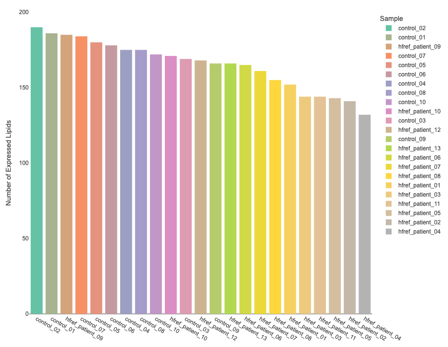
```{r , fig.cap = "Histogram of lipid amount. The histogram describes the variability of the total lipid amount between samples." , eval=FALSE}
# view result: histogram (total amount of lipid)
profiling_result$i.p.amount      
```
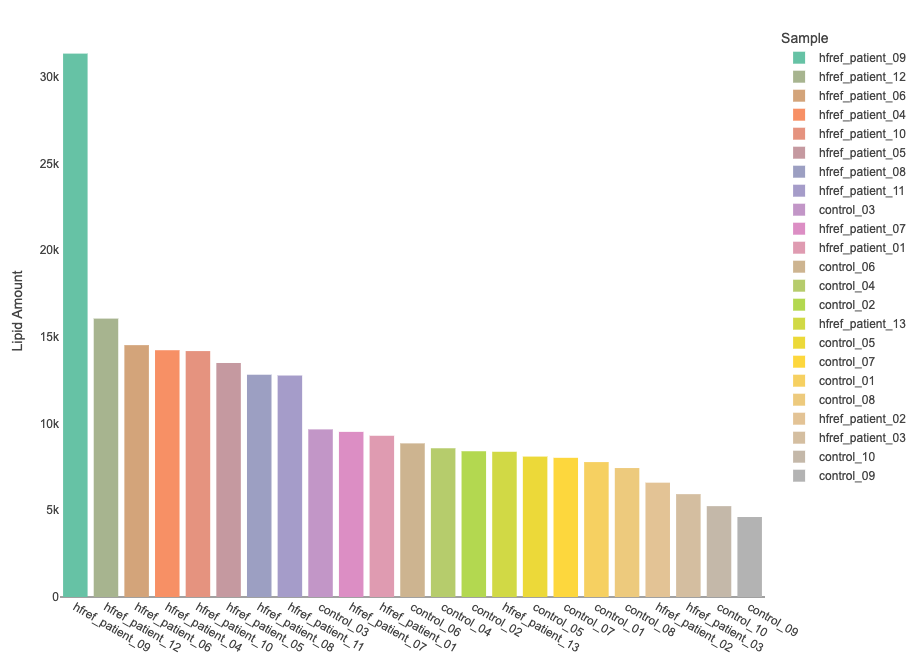
```{r , fig.cap = "Density plot of expression distribution. The density plot uncovers the distribution of lipid expression in each sample (line). All expression was log10 transformed. From this plot, we can have a deeper view of the distribution between samples.", eval=FALSE}
# view result: density plot of expression distribution
profiling_result$p.hist.value
```
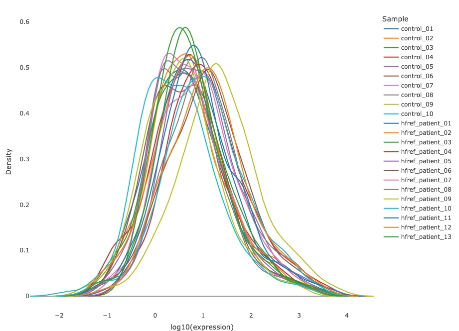

# Dimensionality reduction {#DimensionReduce}
Dimensionality reduction is commonly used when dealing with large numbers of observations and/or large numbers of variables in lipids analysis. It transforms data from a high-dimensional space into a low-dimensional space so that it retains vital properties of the original data and is close to its intrinsic dimension.

Here we provide 3 dimensionality reduction methods and 4 clustering methods. As for the number of groups shown on the PCA, t-SNE, and UMAP plot, it can be defined by users (default: 2 groups). 

1. **Dimensionality reduction methods**: PCA, t-SNE, UMAP.
2. **Clustering methods**: K-means, partitioning around medoids (PAM), Hierarchical clustering, and DBSCAN

##  PCA {#PCA}
PCA (Principal component analysis) is an unsupervised linear dimensionality reduction and data visualization technique for high dimensional data, which tries to preserve the global structure of the data. Scaling (by default) indicates that the variables should be scaled to have unit variance before the analysis takes place, which removes the bias towards high variances. In general, scaling (standardization) is advisable for data transformation when the variables in the original dataset have been measured on a significantly different scale. As for the centering options (by default), we offer the option of mean-centering, subtracting the mean of each variable from the values, making the mean of each variable equal to zero. It can help users to avoid the interference of misleading information given by the overall mean.
```{r Profiling: dimensionality reduction - PCA}
# data processing of exp_data
exp_transform_table <- data_process(exp_data, exclude_var_missing=TRUE,
                                    missing_pct_limit=50, 
                                    replace_zero=TRUE, zero2what='min', 
                                    xmin=0.5, replace_NA=TRUE,
                                    NA2what='min', ymin=0.5, 
                                    pct_transform=TRUE,
                                    data_transform=TRUE, trans_type='log',
                                    centering=FALSE, scaling=FALSE)
# conduct PCA
PCA_result <- PCA(exp_transform_table,
                  group_info = NULL, sig_feature = NULL,
                  scaling=TRUE, centering=TRUE, cluster_method='kmeans',
                  group_num=2, var1 = NULL, var2 = NULL,
                  insert_ref_group=NULL, ref_group=NULL,
                  n_PC=c(1,2), top_n_feature=10)

# view result: PCA prcomp
head(PCA_result[[1]], 1)
```

```{r , fig.cap = "PCA plot"}
# view result: PCA plot
PCA_result[[4]]
```
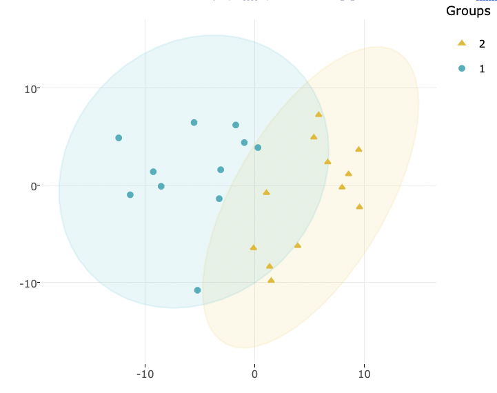
Accompanying with the PCA plot, we offer scree plot criterion, which is a common method for determining the number of PCs to be retained. The "elbow" of the graph indicates all components to the left of this point can explain most variability of the samples.
```{r, fig.cap = "Scree plot"}
# view result: scree plot of top 10 principle components
PCA_result[[5]] 
```
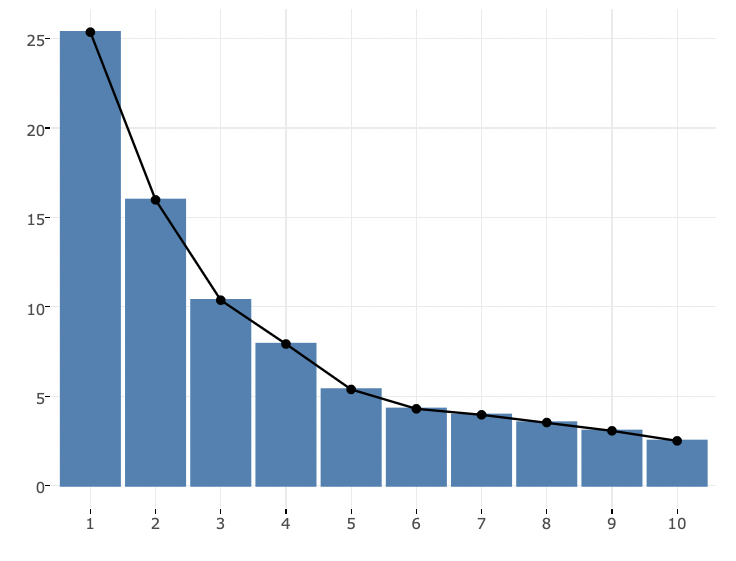
Next, the two data frames related to PCA show the contribution to each principal component in each sample and the contribution of each feature (lipid species).
```{r }
# view result: data frame of PCA rotated data
head(PCA_result[[2]][,1:5], 5)
# view result: data frame of PCA contribution table
head(PCA_result[[3]][,1:5], 5)
```
Following is the correlation circle plot that reveals the relationships between all variables.
```{r, fig.cap = "Correlation circle plot. The correlation circle plot showing the correlation between a feature (lipid species) and a principal component (PC) used as the coordinates of the variable on the PC [@abdi2010principal]. The positively correlated variables are in the same quadrants while negatively correlated variables are on the opposite sides of the plot origin. The closer a variable to the edge of the circle, the better it represents on the factor map."}
# view result: correlation circle plot of PCA variables
PCA_result[[7]]
```
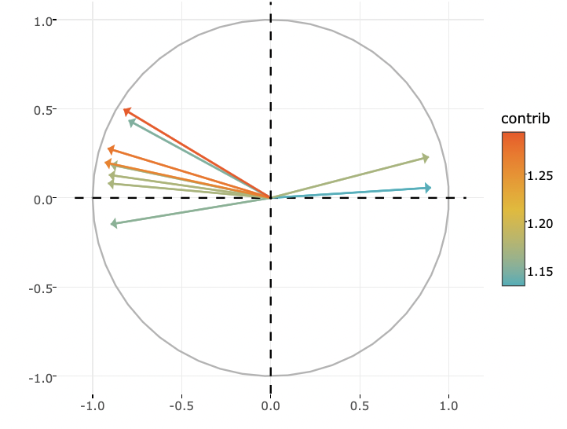

Lastly, we can have a closer look at the contribution of top 10 features to a user-defined principal component (e.g., PC1, PC2, or PC1+PC2). Therefore, in the histogram, we can find out the features (lipid species) that contribute more to the user-defined principal component.
```{r, fig.cap = "Bar plot of contribution of top 10 features", eval=FALSE}
# view result: bar plot of contribution of top 10 features
PCA_result[[6]]  
```
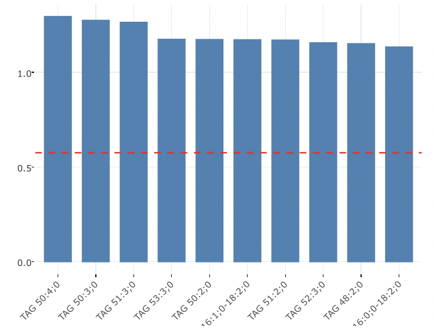

## t-SNE  {#t-SNE}
t-SNE (t-Distributed Stochastic Neighbour Embedding) is an unsupervised non-linear dimensionality reduction technique that tries to retain the local structure(cluster) of data when visualising the high-dimensional datasets. Package `r CRANpkg("Rtsne")` is used for calculation, and PCA is applied as a pre-processing step. In t-SNE, `perplexity` and `max_iter` are adjustable for users. The `perplexity` may be considered as a knob that sets the number of effective nearest neighbours, while `max_iter` is the maximum number of iterations to perform. The typical perplexity range between 5 and 50, but if the t-SNE plot shows a ‘ball’ with uniformly distributed points, you may need to lower your perplexity [@van2008visualizing].
```{r Profiling: dimensionality reduction - t-SNE}
# data processing of exp_data
exp_transform_table <- data_process(exp_data, exclude_var_missing=TRUE,
                                    missing_pct_limit=50, 
                                    replace_zero=TRUE, zero2what='min', 
                                    xmin=0.5, replace_NA=TRUE,
                                    NA2what='min', ymin=0.5, 
                                    pct_transform=TRUE,
                                    data_transform=TRUE, trans_type='log',
                                    centering=FALSE, scaling=FALSE)
# conduct t-SNE
tsne_result <- tsne(exp_transform_table, group_info = NULL,
                    sig_feature = NULL, pca=TRUE, perplexity=5,
                    max_iter=500, cluster_method='kmeans',
                    group_num=2, var1 = 'euclidean', var2 = NULL,
                    insert_ref_group = NULL, ref_group = NULL)

# view result: data frame of t-SNE data
head(tsne_result[[1]], 5)
```

```{r , fig.cap = "t-SNE plot", eval=FALSE}
# view result: t-SNE plot
tsne_result[[2]] 
```
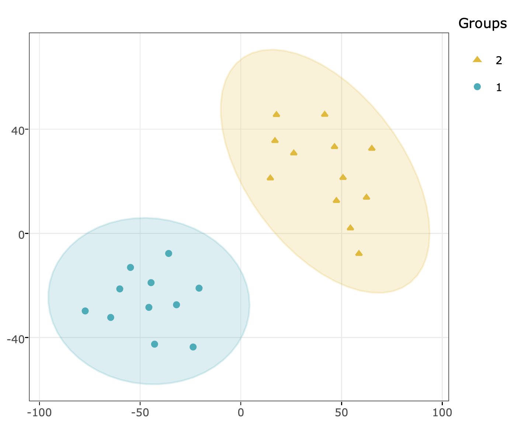

##  UMAP  {#UMAP}
UMAP (Uniform Manifold Approximation and Projection) using a nonlinear dimensionality reduction method, Manifold learning, which effectively visualizing clusters or groups of data points and their relative proximities. Both tSNE and UMAP are intended to predominantly preserve the local structure that is to group neighbouring data points which certainly delivers a very informative visualization of heterogeneity in the data. The significant difference with t-SNE is scalability, which allows UMAP eliminating the need for applying pre-processing step (such as PCA). Besides, UMAP applies Graph Laplacian for its initialization as tSNE by default implements random initialization. Thus, some people suggest that the key problem of tSNE is the Kullback-Leibler (KL) divergence, which makes UMAP superior over t-SNE. Nevertheless, UMAP’s cluster may not good enough for multi-class pattern classification [@mcinnes2018umap].
    
The type of distance metric to find nearest neighbors the size of the local neighborhood (as for the number of neighboring sample points) are set by parameter `metric` and `n_neighbors`. Larger values lead to more global views of the manifold, while smaller values result in more local data being preserved. Generally,  values are set in the range of 2 to 100. (default: 15).

```{r Profiling: dimensionality reduction - UMAP}
# data processing of exp_data
exp_transform_table <- data_process(exp_data, trans_type='log',
                                    exclude_var_missing=TRUE,
                                    missing_pct_limit=50,
                                    replace_zero=TRUE, replace_NA=TRUE,
                                    zero2what='min', xmin=0.5,
                                    NA2what='min', ymin=0.5,
                                    pct_transform=TRUE, centering=FALSE,
                                    data_transform=TRUE, scaling=FALSE )
# conduct UMAP
UMAP_result <- UMAP(exp_transform_table, group_info=NULL,
                    sig_feature=NULL, n_neighbors=15,
                    scale=TRUE, metric='euclidean', group_num=2,
                    cluster_method='kmeans', var1=NULL, var2=NULL,
                    insert_ref_group=NULL, ref_group=NULL)

# view result: data frame of UMAP data
head(UMAP_result[[1]], 5)
```

```{r , fig.cap = "UMAP plot", eval=FALSE}
# view result: UMAP plot
UMAP_result[[2]]   
```
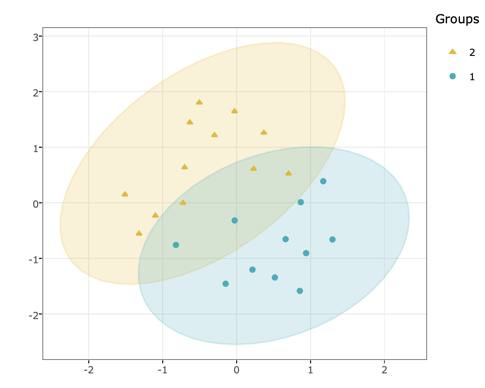

# Correlation heatmap
The correlation heatmap illustrates the correlation between samples or lipid species and also depicts the patterns in each group. The correlation is calculated by the method defined by parameter `corr_method`, and the correlation coefficient is then clustered depending on method defined by parameter `distfun` and the distance defined by parameter `hclustfun`. Two heatmaps will be shown by lipid species and by samples. Please note that if the number of lipids or samples is over 50, the names of lipids/samples will not be shown on the heatmap.
```{r Profiling: correlation heatmap}
# data processing of exp_data
exp_transform <- data_process(exp_data, exclude_var_missing=TRUE,
                              missing_pct_limit=50, replace_zero=TRUE,
                              zero2what='min', xmin=0.5, replace_NA=TRUE,
                              NA2what='min', ymin=0.5, pct_transform=TRUE,
                              data_transform=TRUE, trans_type='log',
                              centering=FALSE, scaling=FALSE)
# correlation calculation
corr_result <- corr_heatmap(exp_transform, corr_method="pearson",
                            distfun="maximum", hclustfun="average")

# view result: matrix of correlation coefficients           
head(corr_result$sample_corr_coef[, 1:5], 5)

# view result: matrix of correlation p-value  
head(corr_result$sample_corr_p[, 1:4], 5)

# view result: matrix of reorder sample correlation
head(corr_result$reorder_sample_corr_coef[, 1:3], 5)

# view result: matrix of correlation coefficients between lipids
head(corr_result$lipids_corr_coef[, 1:5], 5)

# view result: matrix of correlation p-value between lipids
head(corr_result$lipid_corr_p[, 1:4], 5)
```

```{r , fig.cap = "Heatmap of sample to sample correlations.", eval=FALSE}
# view result: sample-sample heatmap
corr_result$sample_hm  
```
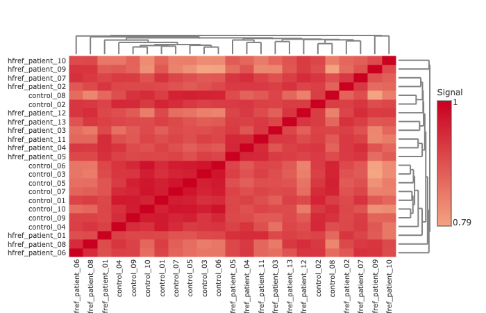
The above heatmap reveals sample to sample correlations. Correlations between lipid species are colored from strong positive correlations (red) to no correlation (white).
```{r , fig.cap = "Heatmap of lipid to lipid correlations.", eval=FALSE}
# view result: lipid-lipid correlations heatmap
corr_result$lipids_hm
```
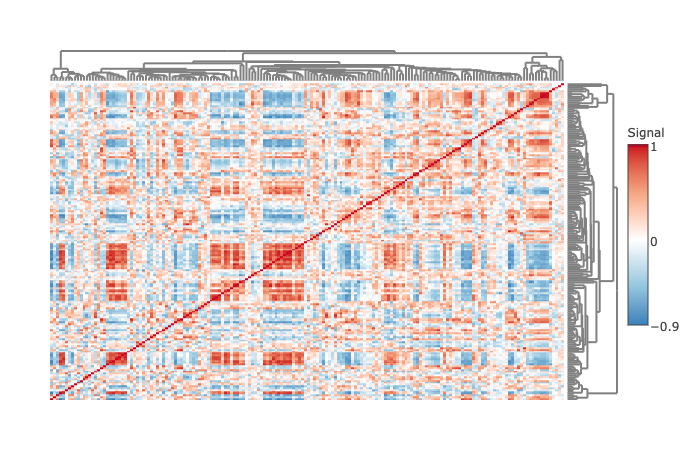
The above heatmap illustrates the lipid to lipid correlations. Correlations between lipid species are colored from strong positive correlation (red) to no correlation (white), to negative correlation (blue).

# Lipid characteristics {#subsec:pro-char}
Now, we are going to take a view of lipid expression over specific lipid characteristics. First, lipids are classified by characteristics selected from the 'Lipid characteristics' table. Here, we select "class" as the selected lipid characteristic. The results will be showed by two plots.
```{r Profiling: lipid characteristics, eval=FALSE}
# lipid characteristic
char_var <- colnames(lipid_char_table)[-1]
# calculate lipid expression of selected characteristic
compo_result <- exp_compo_by_lipidinfo(exp_data, lipid_char_table, char_var[1])
```

```{r , fig.cap = "Bar plot classified by selected characteristic. The bar plot depicts the expression level of each sample within each group (e.g., PE, PC) of selected characteristics (e.g., class).", eval=FALSE}
# view result: bar plot
compo_result$p.barplot.p  
```
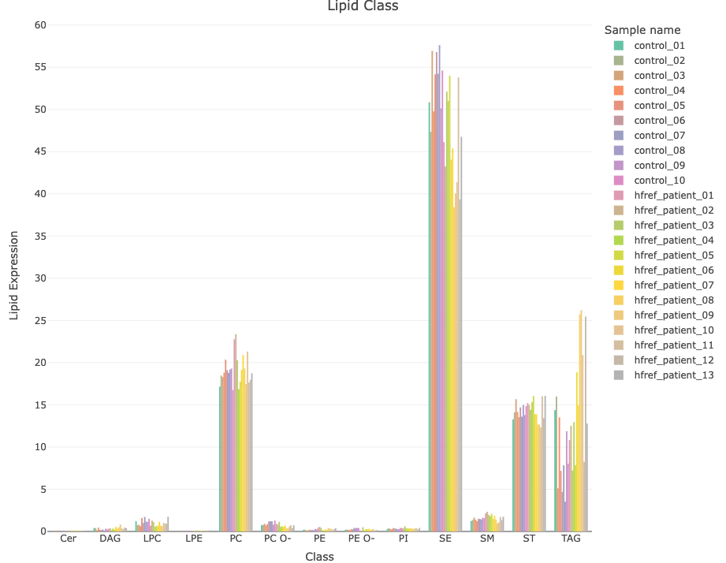
```{r , fig.cap = "Lipid class composition. The stacked horizontal bar chart illustrates the percentage of characteristics in each sample. The variability of percentage between samples can also be obtained from this plot.", eval=FALSE}
# view result: stacked horizontal bar chart
compo_result$p.compos      
```
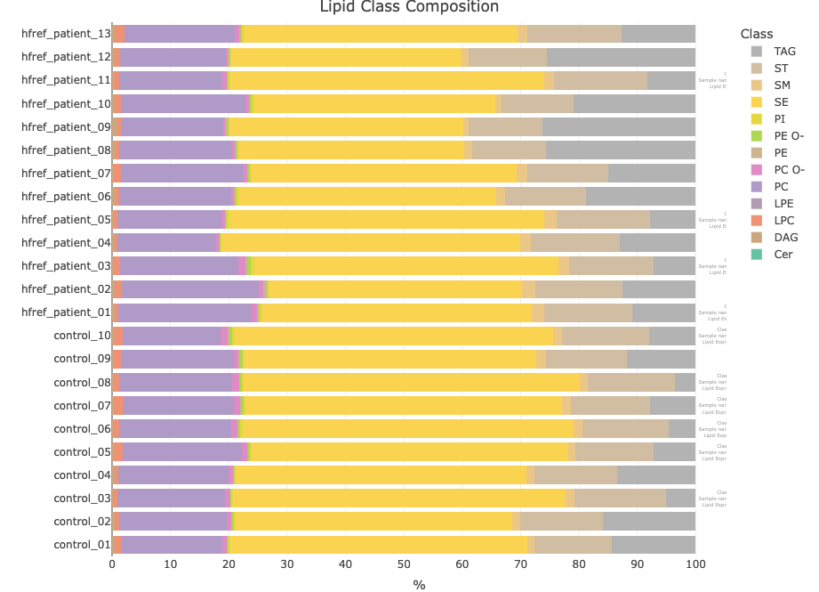
# Session info
```{r sessionInfo, echo=FALSE}
sessionInfo()
```

# References

